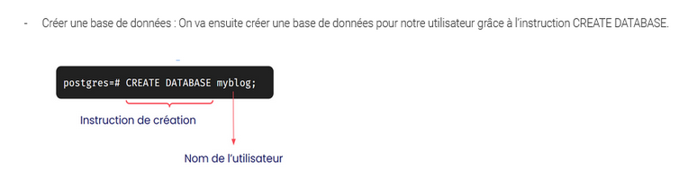
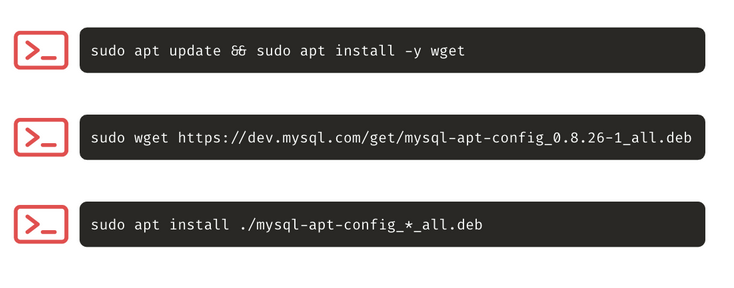

# Formation devOps

:pill: La capsule

:fire:  Documentation d'accompagnement au cycle devOps :fire:

---

## Semaine 2 - BDD, Réseaux, SSH, GIT

### Jour 1 : BDD ###

---

#### :warning: Erreurs à corriger dans les cours 

- cours > postgreSql

petite erreur sur le cours Base de données Sem2 Jour1 : c'est la creation de BDD, pas de user ^^



- cours > install mysql
certains élèves ont eu des soucis avec le package _mysql-apt-config_0.8.26-1_all.deb_
ils ont du utiliser mysql-apt-config_0.8.**32**-1_all.deb



---

#### :bike: 1 - START WITH POSTGRESQL


##### Install PostgreSQL


👉 Installez le serveur PostgreSQL à l’aide des 3 commandes suivantes.

```
sudo apt update
sudo apt install -y postgresql postgresql-contrib
```

Vérfier le cluster dans la liste et démarrer:

```
pg_lsclusters
```
> liste  avec NUM / NAME

```
sudo pg_ctlcluster <NUM> <NAME> start
```

👉 Vérifiez que votre serveur est bien installé et démarré en vous y connectant avec l’utilisateur "postgres" via sudo, puis affichez la version de PostgreSQL.

```
sudo -u postgres psql
```

```
postgres=# SELECT VERSION();
```


##### Création d'un utilisateur local

👉 À l’installation, le super user par défaut est "postgres". Accédez au shell psql en tant que "postgres" et créez un nouvel utilisateur "developer" avec le mot de passe "qwerty".

```
postgres=# CREATE USER developer WITH ENCRYPTED PASSWORD 'qwerty';
```


##### Création d'une DB

👉 Créez une base de données appelée "mydb".

```
CREATE DATABASE mydb;
```

👉 Attribuez tous les droits à l’utilisateur "developer" sur la base de données nouvellement créée.

```
GRANT ALL ON DATABASE mydb TO developer;
ALTER DATABASE mydb OWNER TO developer;
```

👉 Déconnectez vous de la base de données via le raccourci "Ctrl + D" puis connectez-vous à la base de données avec le nouvel utilisateur "developer"

```
psql -U developer -h 127.0.0.1 -d mydb
```

Contrairement à tout à l’heure, vous ne passez par sudo afin de vous connecter à la base de données, car vous n’utilisez plus l’utilisateur "postgres".

_- L’option "-U" permet de spécifier le nom de l’utilisateur avec lequel vous voulez vous connecter à la base de données_

_- L’option "-h" permet de forcer la connexion à la base de données local (d’où l’IP 127.0.0.1), c’est obligatoire pour les utilisateurs autres que "postgres"_

_- L’option "-d" permet de sélectionner la base de données "mydb"_


##### Création d'une table

👉 Créez une nouvelle table "myusers" qui doit contenir les clés suivantes avec les types de données appropriés :
* id
* firstname
* lastname
* email
* role
* created_on
* last_login

```
CREATE TABLE myusers(   
    id serial PRIMARY KEY,   
    firstname VARCHAR NOT NULL,   
    lastname VARCHAR NOT NULL,   
    email VARCHAR UNIQUE NOT NULL,   
    role VARCHAR NOT NULL,   
    created_on TIMESTAMP NOT NULL,   
    last_login TIMESTAMP 
);
```

👉 Affichez la liste des tables de votre base de données.

```
\d
```

👉 Enregistrez un nouvel utilisateur dans la table "myusers" avec les données proposées dans la requête SQL suivante.

```
INSERT INTO myusers(firstname, lastname, email, role, created_on, last_login) VALUES ('John', 'Doe', 'john.doe@gmail.com', 'admin', now(), now());
```

👉 Affichez le contenu de toutes les colonnes contenues dans la table "myusers".

```
SELECT * FROM myusers;
```

👉 Supprimez la table "myusers".

```
DROP TABLE myusers;
```

👉 Enfin, connectez-vous avec l’utilisateur "postgres" puis supprimez la base de données "mydb".

postgres=# DROP DATABASE mydb;


---

#### :bike: 2 - DUMP MY DATABASE


##### Restauration d’un dump PostgreSQL


👉 Récupérez la ressource [dumpmydatabase.zip](dumpmydatabase.zip) ci-joint et dezipez la pour obtenir <mark>dump.sql</mark>.

👉 Créez une nouvelle base de données nommée "dumpmydatabase".


```
CREATE DATABASE dumpmydatabase;
```

👉 Attribuez tous les droits à l’utilisateur "developer" sur la base de données nouvellement créée et transférer lui la propriété de la base de données.

```
GRANT ALL ON DATABASE dumpmydatabase TO developer;
ALTER DATABASE dumpmydatabase OWNER TO developer;
```

👉 Importez le dump fourni grâce à la commande suivante. Le dump contient la structure et le contenu de la base de données.

```
psql -U developer -h 127.0.0.1 -d dumpmydatabase -f dump.sql
```

👉 Vérifiez que le dump a bien été importé en récupérant le contenu des tables "users" puis "logs". 

```
psql -U developer -h 127.0.0.1 -d dumpmydatabase
```

```
SELECT * FROM myusers;
SELECT * FROM logs;
```

##### Exportation d’un dump PostgreSQL 

👉 Une fois la base de données restaurée, ajoutez un nouvel utilisateur dans la table users.


```
INSERT INTO users(firstname, lastname, email, role, created_on, last_login) VALUES ('John', 'Doe', 'john.doe@gmail.com', 'admin', now(), now());
```

👉 Enfin, après être sorti de postgresql, exportez un nouveau dump nommé "newdump.sql" grâce à la commande Linux suivante. Le dump contient la structure et le contenu de la base de données, y compris le nouvel utilisateur créé précédemment.

```
pg_dump -U developer -h 127.0.0.1 --format=p --file=newdump.sql dumpmydatabase
```

> [!WARNING] 
> cette commande doit être exécutée dans votre terminal et non pas lorsque vous êtes connecté à une base de données via psql.


---

#### :bike: 3 - ARE YOU AWAKE


[ ] <ins>### Restauration d’un dump PostgreSQL ###</ins>

👉Exécutez une commande afin de vous assurer que votre service PostgreSQL répond correctement. Vous pouvez chercher dans la documentation PostgreSQL.

```
pg_isready
```

👉 Intégrez cette commande dans un script qui fera cette vérification toutes les 5 secondes.

- Création du script :

```
#!/usr/bin/env/ 
while [1=1]; do 
pg_isready
sleep 5
done
```


---

#### :bike: 4 - START WITH MYSQL


##### Install


👉 Installez MYSQL sur votre VM debian (exemple avec Ubuntu) et starrtez le service

```
sudo apt install mysql-server
sudo systemctl start mysql.service
```

> Attention sur Ubuntu le service secure config nécessite l'étape suivantes :
> (cela est du au script secure install avec le user root)
>
> Open Mysql
>
```
sudo mysql
```
>
> Alter Root User
>
```
ALTER USER 'root'@'localhost' IDENTIFIED WITH mysql_native_password BY 'password';
```
>
> Exit mysql
>
```
exit
```
>

👉 Lancez le script secure_install

```
sudo mysql_secure_installation
```

> Sur ubuntu pour finaliser le user root config et pouvoir se logger avec <mark>surdo mysql</mark>
>
```
mysql -u root -p
```
>
```
ALTER USER 'root'@'localhost' IDENTIFIED WITH auth_socket;
```
>
```
exit
```

##### Création user et DB

👉 Vous allez maintenant vous connecter à votre instance de MYSQL. 

```
sudo mysql
```

👉 Maintenant que vous êtes identifié, créez un utilisateur “developer” qui aura comme mot de passe “qwerty”.  

```
CREATE USER 'developer'@'localhost' IDENTIFIED BY 'qwertyt';
```

👉 Créez ensuite une base de données nommée “mydb”, attribuez ensuite les droits sur cette base de données à l’utilisateur développer. 
