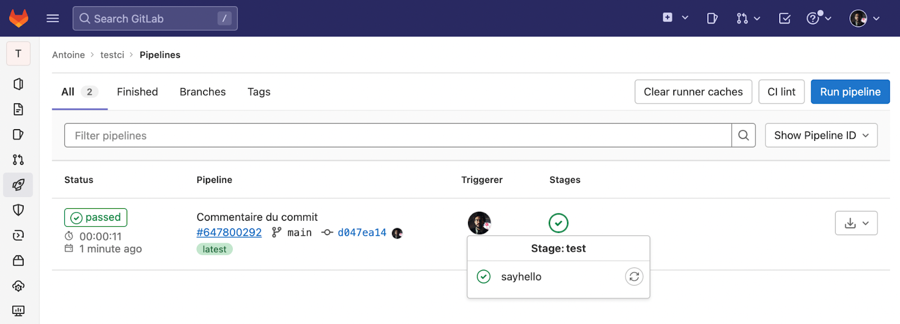

**Formation devOps**
_La capsule - Batch Juin-Août 2024_

:fire: Exercices et corrections formation devOps :fire:

---

**Semaine 3 - GIT JIRA et CI**

**Jour 3 : CI**

---

# 1 - You Had One Job

## creation d'une pipeline 

La méthode CI/CD  consiste à construire, tester et déployer en permanence des modifications apportées au code d’une application et ce de manière itérative.
Cette méthode permet de réduire le risque de développer et déployer un code de mauvaise qualité ou buggé, le tout avec le moins d’intervention humaine possible grâce à l’automatisation et les pipelines.

Vous allez commencer par vous concentrer sur la partie intégration continue (CI) qui est pratique visant à build et tester automatiquement chaque changement soumis à un dépôt Git distant afin de garantir que ces modifications passent les normes de conformité du code établies pour l’application.

👉 Créez un repository GitLab nommé "testci".

👉 En vous inspirant de la documentation de GitLab et à partir de VS Code, créez un fichier ".gitlab-ci.yml" basique content un seul stage nommé "test" et contenant un job "say-hello" chargé de faire une simple commande : echo "Hello world!".

```
stages:
  - test

say-hello:
  stage: test
  script:
    - echo "Hello world!"
```

👉 Versionnez le fichier ".gitlab-ci.yml" et poussez la branche courante vers le dépôt distant.

_vous avez set le repo git avec add url etc.._

👉 Sur GitLab, vérifiez l’exécution de la pipeline en regardant le résultat du job "sayhello" dans le stage "test" afin 
de repérer l’affichage du fameux message "Hello world!".




## configuration d'une pipeline 

Pour l’instant, cette pipeline s’exécutera à chaque push sur le dépôt distant, peu importe la branche impliquée.

👉 Trouvez un moyen de lancer le job "say-hello" uniquement lors d’un push sur la branche "development" et testez ces changements en créant une branche en local puis en la poussant vers GitLab.

```
stages:
  - test

jobs:
  stage: test
  script:
  - echo "Hello World !"
  rules:
  - if: "$CI_COMMIT_BRANCH == 'development'"
```
